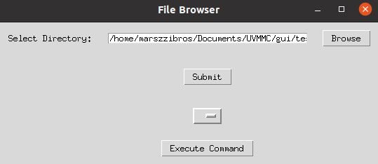

# UVMMC C-ARM Automation GUI

This GUI facilitates the acquisition of CT coordinates for the target areas (arch, head, neck) to train the Deep Learning Model.

## Table of Contents

- [Getting Started](#getting-started)
  - [Prerequisites](#prerequisites)
  - [Installation](#installation)
- [Usage](#usage)

## Getting Started

### Prerequisites

1. NVIDIA GPU with > 11 GB is preferred, but I have been running the program with 8 GB.
2. Ubuntu environment is strongly recommanded (Windows will also work.)
3. The codes is programmed in python 3.9

### Installation

Clone the repository
```bash
git clone https://github.com/marszzibros/UVMMC.git
cd UVMMC/gui/
```
Set up the Conda environment

```bash
conda create env -f environment.yml
```

## Usage 
You will need a CT scan with .nii.gz (nifti) extension. If you have arrays of .dcm instead, use the following command:

```bash
python3 convert.py
```
Before you use this program, make sure the `file_path` is specified to your directory where dcm files are located

To run the GUI, please use the following command:
```bash
python3 select_image_gui.py
```


1. Click on `Browse` button to find the path to your nifti files
2. Click on `Submit`, it will tell you if you have a compatible file in the directory
3. Choose the nifti file you want to simulate
4. Press `Execute Command` button.

