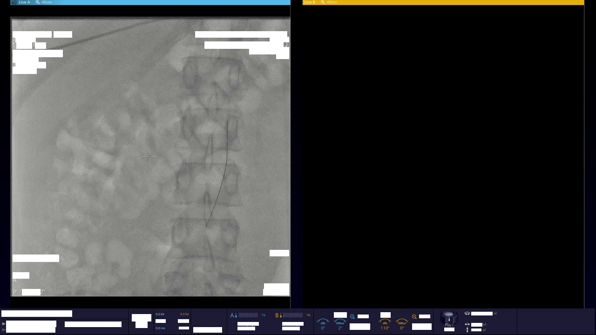

<div align="left">

# vidtext 


</div>

## Installation
1. Make sure you have conda in your device
    <details>
    <summary>miniconda installations [click to expand]</summary>

    **(skip this step if you already have one)**

    download
    ```bash
    wget https://repo.anaconda.com/miniconda/Miniconda3-latest-Linux-x86_64.sh
    ```
    install
    ```bash
    bash Miniconda3-latest-Linux-x86_64.sh -bfu -p 
    ```
    removing installation file and adding conda to the system path
    ```bash
    ~/miniconda3
    rm Miniconda3-latest-Linux-x86_64.sh
    ~/miniconda3/bin/conda init
    source ~/.bashrc
    ```
    </details>
2. Clone the repository
    ```
    git clone https://github.com/marszzibros/UVMMC.git
    ```
3. Move to the cloned directory
    ```bash
    cd UVMMC/vidtext/
    ```
4. Create conda environment and activate it 
    ```bash
    conda env create -n vidtofrm -f vidtofrm.yml
    conda activat vidtofrm
    ```
## Example

**usage: test.py [-h] -i INPUT [-b BATCH] [-e EVERY] [-g GPU] -o OUTPUT**

<table>
    <tr>
        <th>-h, --help</th>                 
        <td>show this help message and exit</td>
    </tr>
    <tr>
        <th>-i INPUT, --input INPUT</th>    
        <td>Enter input file path (string)</td>
    </tr>
    <tr>
        <th>-b BATCH, --batch BATCH</th>
        <td>Enter batch size (int) default 5 (optional)</td>
    </tr>
    <tr>
        <th>-e EVERY, --every EVERY</th>
        <td>Enter how many frames to skip (int) defualt 2 (optional)</td>
    </tr>
    <tr>
        <th>-g GPU, --gpu GPU</th>
        <td>Enter the GPU status (True/False)</td>
    </tr>
    <tr>
        <th>-o OUTPUT, --output OUTPUT</th>
        <td>Enter output file path (string)</td>
    </tr>

</table>

```bash
# run test.py with input path "test.avi" and output path "sample.mp4", and enable GPU acceleration
python test.py -i test.avi -g True -o sample.mp4
```


